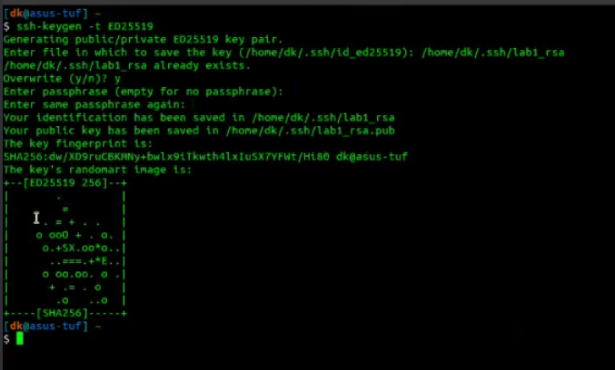
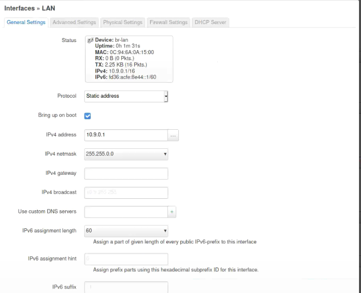
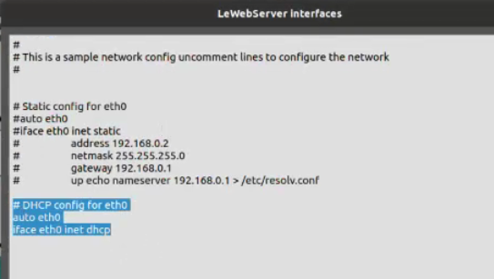
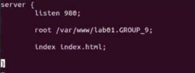
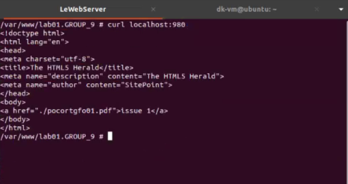
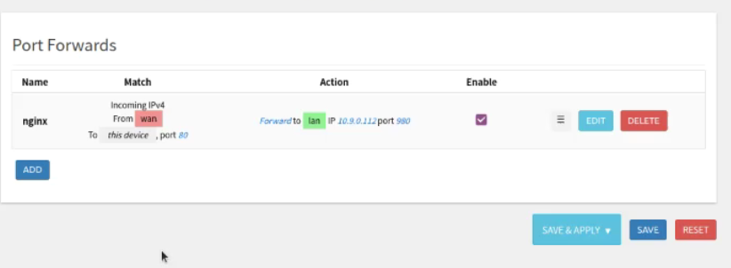
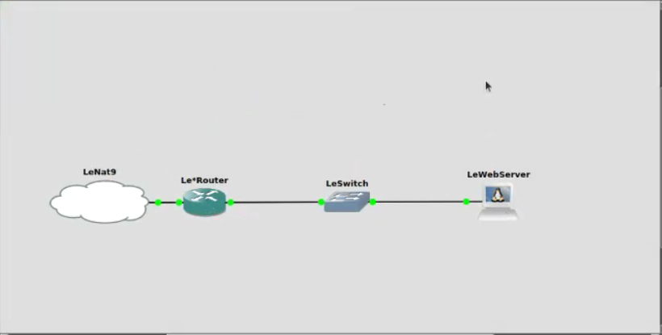
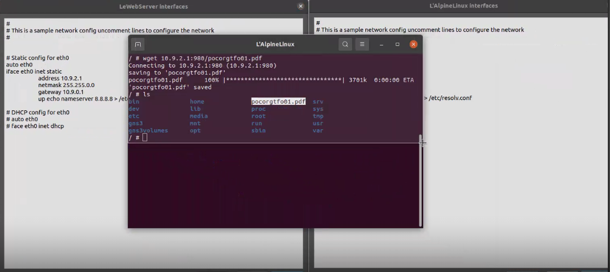

## Stage 1

- We've created a new blank project and called it `Lab01`
- We've spawned a NAT appliance by drag-and-dropping it to the canvas and renamed it to `LeNat9`
- We've spawned an OpenWrt 19.07.4 appliance by drag-and-dropping it to the canvas and renamed it to `Le*Router`
- We've connected `Le*Router`(eth1) to `LeNat9`(nat0) with a wire


## Stage 2

- We've opened the terminal of our OpenWRT instance (Le*Router)
- We've opened vi editor and modified `/etc/config/firewall` by adding following redirect rule to the end of the file:
```
config rule
  option name       'Allow SSH'
  option src        'wan'
  option proto      'tcp'
  option dest_port  '922'
  option target     'ACCEPT'
  option enabled    '1'
```
- We've restarted the Firewall by running `/etc/init.d/firewall restart`
- We've installed `openssh-server` package on our router (aka `Le*Router`) by running:
```shell
$ opkg update                 # Fetch all available packages
$ opkg install openssh-server # Install openssh-server
```
- We've modified `/etc/ssh/sshd_config` by changing the port
- We've modified the password of root on OPENWRT Machine with SPACE
```shell
$ passwd root
```

- We've generated a new SSH KEYPAIR with ED25519 format.



- The Ed25519 (introduced to OpenSSH version 6.5) uses elliptic curve cryptography that offers a better security with faster performance compared to RSA or ECDSA.

- Today, the RSA is the most widely used public-key algorithm for SSH key. Compared to Ed25519, it’s slower and even considered a security risk if it’s generated with the key smaller than 2048-bit length.

- A Ed25519 public-key is compact, only contains 68 characters, compared to RSA 3072 that has 544 characters. Generating the key is also almost as fast as the signing process. It’s fast to perform batch signature verification with Ed25519 and built to be collision resilience.

## Stage 3
- We've installed `luci` by running on our OpenWRT machine
```shell
$ opkg install luci
```
- We've modified SSH server config (`/etc/ssh/sshd_config`) by adding following lines to the end of the file:
```sshd_config
PermitRootLogin yes # Grant access to the SSH server as an user from `root` group
Port 922            # Open the ssh sever on port 922
```

- We've setup port forwarding from port 80 on our OpenWRT machine to port 988 on our host machine with SSH by running
```shell
$ sudo ssh -L 988:127.0.0.1:80 root@192.168.122.251 -p 922
```
- We've used ssh tunnel but we can also change the firewall of OpenWrt 

- We've managed to have access to LuCi on our host machine with SSH Tunnel 


## Stage 4

- We've managed to configure Le*Routeur to use a class A



- Here are our reserved ips 


- And so the prefixes are : /8, /12, /16

- We've connected the Alpine linux appliance called LeWebServer to the lan


- We've uncomment DHCP in the WebSever configuration 




## Stage 5
- We've configured NGINX



- We've modified the file /etc/nginx/nginx.conf by adding this line 
```
include /etc/nginx/sites-enabled/*.conf;
```
- To the http part of the config 

- The index.html is now looking like that 



- The two commands sto download the file in the served nginx folder are:

```
curl -L <url> --output <filename>
wget -O <filename> <url>
```
- Now we can see that we can download the pdf 


- We can acesss to this site because we've configured port forwarding on    our router 



## Stage 6
- We added a switch between LeWebServer and Le*Router 



- We added a static ip to LeWebServer 


## Stage 7

- We've created two subnet : subnet 1 on `10.9.1.0/16` subnet 2 on `10.9.2.0/16`. Then we have added Alpine Linux and connect it to the switch in DHCP to access internet 

- Then we've installed curl on Alpine linux and changed it network configuration to be static on the first subnet 


-Then we have donwloaded the file




## Stage 8

- HTTP ➜ RFCS : 1945, 2068, 2616, 7230 to 7237 and 7540.

  https://tools.ietf.org/html/rfc2616 


- SSH ➜ RFC: 4253

  https://tools.ietf.org/html/rfc4253


- IP ➜ RFC: 791

  https://tools.ietf.org/html/rfc791

- Ethernet ➜ RFC: 894

  https://tools.ietf.org/html/rfc894.

