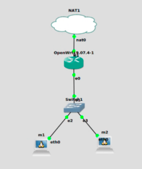
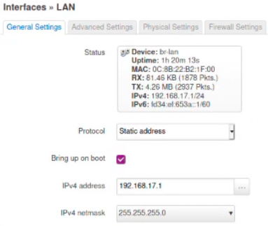
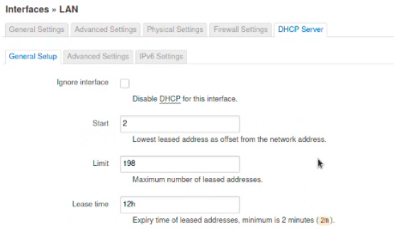
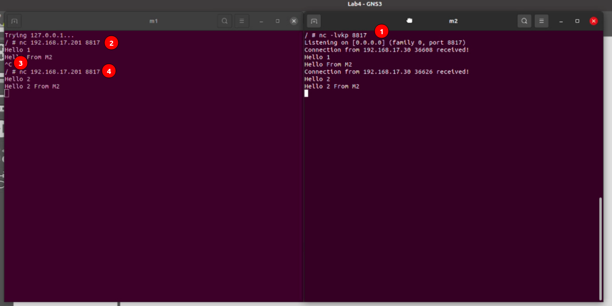
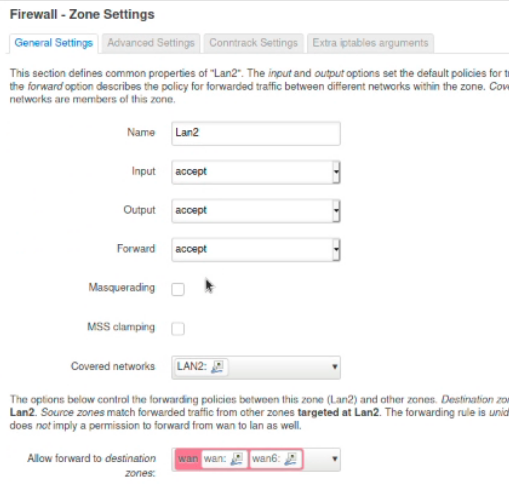

# Lab4.17

## Part 1: Lan One

Replicate the network topology below to be able to follow the instructions we give afterwards:<br>
<br>
Connections are: 
```
NAT       nat0 -> OpenWrt eth1
OpenWrt   eth0 -> Switch  eth1
Alpine m1 eth0 -> Switch  eth2
Alpine m2 eth0 -> Switch  eth3
```

### Remote management interface

To be able to connect to the LuCi web interface on our host machine we should firstly install(or update if it is preinstalled with your OpenWrt version) LuCi on our Open wrt by running
```shell
$ opkg update
$ opkg install luci
```
Then we need to configure dns rules to be able to access the web interface via browser on our host machine. To do this, edit `/etc/config/firewall` by running
```shell
$ vi /etc/config/firewall
```
and add the following rule to the end of the file
```
config rule
  option name       'Allow LuCi'
  option src        'wan'
  option proto      'tcp'
  option dest_port  '80'
  option target     'ACCEPT'
  option enabled    '1'
```
finally restart the firewall, by running:
```shell
$ service firewall restart
```
Now you should be able to connect to LuCi via browser of your host machine, by just typing in the ip address of your OpenWrt in the address bar of the browser.
 
### Network configuration

Go to LuCi web interface, then go to `Network > Interfaces`.
Edit Lan network and set it's ip address to `192.168.17.1`, that places your OpenWrt in `192.168.17.0` subnet.
<br>
Then Edit it's DHCP settings as follows:
<br>
In order for it to give addresses from 2 -> 200 (staring address 2, 198 maximum addresses can be given). Then click `Apply > Save & Apply`.

Edit Alpine m1 network config by right-clicking on it's icon and selecting option `Edit config`. Replace it's contents by
```
auto eth0
iface eth0 inet dhcp
```
That makes your Alpine m1 machine use DHCP provided by your Openwrt router


Edit Alpine m2 network config by right-clicking on it's icon and selecting option `Edit config`. Replace it's contents by
```
auto eth0
iface eth0 inet static
  address 192.168.17.201
  netmask 255.255.255.0
  gateway 192.168.17.1
  up echo nameserver 192.168.17.1 > /etc/resolv.conf
```
That makes your Alpine m2 machine use a static ip address outside of DHCP range of your OpenWrt router. It also makes it use the DNS provided by your OpenWrt router.

In order to work with netcat, first of all install openbsd version of netcat on Alpine m1 & Alpine m2, by running this command on both machines:
```shell
$ apk add netcat-openbsd
```

Then make your Alpine m2 a netcat server by running:
```shell
$ nc -lvukp 8817
# -l Listen for connections
# -v Verbose (optional) to see when a connection is established
# -k Persist the server allowing for multiple connections
# -u Allow UDP connections
# -p Specify the port on which the server will be running
```

and test the connection from by running:
```shell
$ nc -u 192.168.17.201 8817
# -u Connect using UDP
```
on Alpine m1.<br>


## Part 2: Subnet
Go to LuCi web interface, then go to `Network > Interfaces` and add a new interface. Call it `Lan2`, give it an ip address `192.168.18.1` and netmask `255.255.255.252`. Go to the networks firewall rules and create a custom rule called `Lan2`, then `Save -> Save & Apply`. Now, go to `Network > Firewall` and edit it as shown on the image below:


Now create a new Alpine Linux instance and call it m3. Change it's network configuration to:
```

auto eth0
iface eth0 inet static
  address 192.168.18.2
  netmask 255.255.255.252
  gateway 192.168.18.1
  up echo nameserver 192.168.18.1 > /etc/resolv.conf
```
and connect it to your OpenWrt router.


## Part 3: Firewall 

To allow machines in LAN subnet to access LAN2, but LAN2 not have access to LAN we need to create a firewall rule. To create a rule go to `Network > Firewall` and click on add.
Create a rule like the one shown on the image below:


To allow the connection between wan on port 7717 and m3 on port 6317 we need to configure a port forward. To do this, go to `Network > Interfaces > Port Forwards` and create a rule as follows:

We can test that the connection works by creating a new NAT2 and a new Alpine linux machine named m4, setting it's network configuration to: 
```
auto eth0
iface eth0 inet dhcp
```
and then connecting the m4 machine to a newly created NAT2.
Then we launch a TCP netcat server on m3 machine by running `nc -lkvp 6317` and connection to the server by connecting with netcat to our router on port 7713 via NAT `nc 192.168.122.51 7717` (in our case):


To allow the connection between wan on port 6317 and m2 on port 6317 we also need a port forwarding rule. Create one rule, as shown below:

Then we can use the Alpine linux m4, that we've already created and configured in the step above, to test the connection between m4 and m2 using netcat. Launch a udp netcat server on m2, by running `nc -uvklp 6317`, and establishing a udp connection from m4 by running `nc -u 192.168.122.51 6317`:

## Part 4: Misc

### Fun with pipes
To be able to have multiple terminals in one window, install tmux (`apk add tmux`) on your Alpine m2 machine and run it by executing
```shell
$ tmux
```
Split the window in two using a shortcut `ctrl+b %` (Another useful shortcut is `ctrl+b o` to switch between tabs). Create a linux pipe (we will call it `Stream`) by executing:
```shell
$ mkfifo Stream
```
Now we can start to work with our custom pipe.<br>
In the left pane start a netcat server and redirect the `stdout` to your `Stream` pipe by executing:
```shell
$ nc -lkp 6317 > Stream
```
Now, switch the pane to the one on the right and start an udp nc server (notice that bot servers are launched on the same machine simultaneously) with the contents of our pipe passed to the server, by running:
```shell
$ nc -lukp 6317 < Stream
```

Now you can connect the m1 machine to the m2 TCP server by running:
```shell
$ nc 192.168.17.201 6317
```
And connect the m4 machine to the m2 UDP server by running:
```shell
$ nc 192.168.122.51 6317
```
you will also need to send a message from your m4 machine in order to successfully initiate the handshake. Now, you should be able to send a message from your Alpine m1 machine in TCP and see it on your Alpine m4 machine in UDP.

### SSH access

Install `openssh-server` on your OpenWrt, by executing:
```shell
$ opkg install openssh-server
```
Now, edit `/etc/ssh/sshd_config` and uncomment those lines:
```
Port 22
PermitRootLogin yes
```